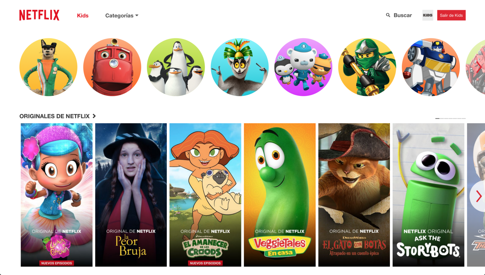

I write this as a parent to a 3 year old son who ~~uses~~ used to use Netflix ~~almost everyday~~ (and tried briefly the Youtube Kids app). I write this because both are plagued with dark design patterns.

> What are dark patterns? In case you don’t know, they’re a design (intentional or not) that leads the person using it to something detrimental to him/herself (and usually beneficial to the product).

**Note before I dive in**: I believe no one at Google or Netflix has done this with the intention to cause harm.

## Optimizing for engagement (and ignoring the consequences)

From an engagement perspective, these apps are flawless: nice design, you see the content straight away, just swipe until you see something that catches your eye. Your kid will be watching something in no time. And that’s the start of the problem.

The lesson this teaches is “let’s start watching **something** (anything) and spend your time doing the easiest thing possible”. This habit of mindless consumption is dangerous, and everyday use will only enforce that.

Adults (and teenagers) are already victims to how addictive and damaging technology can be when left unchecked. We have [less free time](https://twitter.com/randfish/status/870712507916197889?lang=en), which is [key to our wellbeing](https://hbr.org/2017/03/the-busier-you-are-the-more-you-need-quiet-time). We check our phones more than 150 times per day (more from Tristan Harris on [The Need for a New Design Ethics](http://www.tristanharris.com/the-need-for-a-new-design-ethics/)). There’s even a name for the phobia of being out of cellular phone contact: **nomophobia**.

Let’s not set up the next generation to grow up **hooked** to technology, specially when they’re too young to realize it.

## The specifics: what can be improved?

### Infinite content

The first way to lose control of how you spend your time is to start with no boundaries or limits. Infinite content sets the stage for that. You’re not seeing what you like, you’re seeing everything you may like. This sets a premise: This is not about watching what you like, it’s about watching anything, just pick **something**. There is always something to watch.

Hint: you’ll never see “There is nothing worth your time right now”.

### Watch this next

Once you’re done with something, the app with automatically play something next. It’s already hard enough to turn off the TV as it is (it’s the easiest and zero effort way to spend your time). This sets another premise:

> You don’t need to worry about what you’re watching or how long you’re watching it, just keep at it, this is fun!

We’re putting candy in front of kids and expecting them not to eat it all…

### Algorithms are raising our kids (or at least choosing their content)

The brief time my son used Youtube Kids, he ended watching a [mindless screen recording of a spiderman wondering around, with children music](https://www.youtube.com/watch?v=SRME6VjZA8c) (with 5M views…). I don’t care if Youtube warns you that the algorithm isn’t perfect, that doesn’t mean we should expose our kids to it. Netflix at least only has real, safe content (not that it’s all perfect kids).

With all this, I ask…What about helping kids learn, develop new skills, become better people?

You could say this is not the role of these kind of apps, but I disagree. Say a kid loves airplanes. Learning to build your own, or even design one from scratch…I think a lot of kids would love that. Or say a girl loves a show that takes place in the jungle. A documentary about said jungle might be interesting.

These apps could be helping your children explore what they like and are passionate about, and even kickstart hobbies, side projects, or who knows, maybe even what they could end up working on.

How might a platform that incorporates entertainment with learning, courses, activities, or a community even look like? How could it work? I think this is a very interesting angle to explore and pursue this from.
